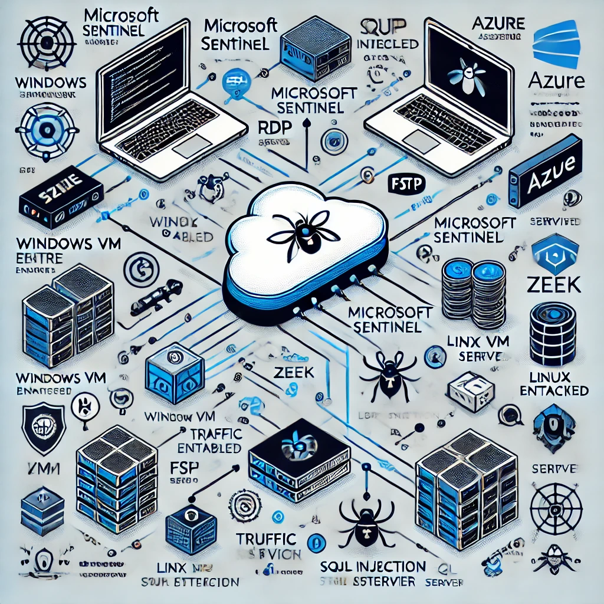

# Azure Honeynet Lab

This project demonstrates the creation and monitoring of a honeynet deployed on Microsoft Azure. The honeynet is designed to attract and analyze a variety of cyberattacks in a controlled environment using multiple virtual machines (Linux, Windows), an FTP server, and a SQL Server. The honeynet was monitored using Microsoft Sentinel, Zeek, and other tools for detailed analysis of network traffic and potential threats.

# Building a SOC + Honeynet in Azure (Live Traffic)

<h2>Video Demonstration</h2>

- ### [YouTube: How To Build a SOC + Honeynet in Azure](https://youtu.be/g-bWd-6B0uY?si=pjDYKEyWwAC79vSI)

- ### [YouTube: How To Build a SOC + Honeynet in Azure](https://youtu.be/mOjbD7FkUUI)
## Table of Contents

- [Overview](#overview)
- [Architecture](#architecture)
- [Setup](#setup)
- [SQL Server Deployment](#sql-server-deployment)
- [Monitoring and Analysis](#monitoring-and-analysis)
- [KQL Queries](#kql-queries)
- [Hardening](#hardening)
- [Conclusion](#conclusion)
- [References](#references)

## Overview

This honeynet setup includes:
- A **Windows VM** (configured with RDP access).
- A **Linux VM** (with SSH access).
- An **FTP Server** for monitoring potential brute force or unauthorized access attempts.
- A **SQL Server** for attracting SQL-based attacks.
- Monitoring using **Microsoft Sentinel** for analyzing network traffic, malicious behavior, and generating alerts.

## Architecture

### Components
- **Windows VM**: Running a default Windows installation with RDP access enabled.
- **Linux VM**: Running a Ubuntu server with SSH access.
- **FTP Server**: Exposed to attract brute-force login attempts.
- **SQL Server**: Deployed to monitor SQL-related cyberattack attempts.
- **Microsoft Sentinel**: Used for continuous monitoring and alert generation.
- **Zeek**: Used for deep traffic inspection and anomaly detection.

## Setup

1. **Create Azure Virtual Machines**:
   - Deploy a Windows VM with RDP enabled.
   - Deploy a Linux VM with SSH enabled.
   - Deploy a SQL Server on Azure for database-related attack vectors.

2. **Install and Configure Services**:
   - Install and configure **Zeek** on the Linux VM for traffic monitoring.
   - Enable **FTP** on the Linux server.
   - Set up the **SQL Server** for vulnerability monitoring.

3. **Integrate Microsoft Sentinel**:
   - Connect the virtual machines and SQL Server to Microsoft Sentinel for monitoring.
   - Create the necessary data connectors for **Security Events**, **Syslog**, and **Azure Defender Alerts**.

## SQL Server Deployment

The **SQL Server** was deployed to attract database-related attacks and analyze any malicious activities targeting the SQL database. Basic configurations were applied, and monitoring through Microsoft Sentinel was enabled to capture any suspicious events.

### SQL Server Setup Steps:
1. Deploy an **Azure SQL Server**.
2. Configure the **firewall rules** to expose it for testing.
3. Enable **logging** and integrate with **Microsoft Sentinel** for security monitoring.

## Monitoring and Analysis

The honeynet is continuously monitored using **Microsoft Sentinel**, **Zeek**, and **Wireshark** for detailed traffic analysis. **Heatmaps** were created to track brute-force SSH and RDP attacks, while SQL injection and FTP login attempts were analyzed on the corresponding servers.

## KQL Queries

The following KQL (Kusto Query Language) queries are used to monitor key metrics related to security events, network flows, and incident alerts.

| Metric                                       | Query                                                                                                                                            |
|----------------------------------------------|--------------------------------------------------------------------------------------------------------------------------------------------------|
| **Start/Stop Time**                          | `range x from 1 to 1 step 1` `| project StartTime = ago(24h), StopTime = now()`                                                              |
| **Security Events (Windows VMs)**            | `SecurityEvent` `| where TimeGenerated>= ago(24h)` `| count`                                                                       |
| **Syslog (Linux VMs)**                       | `Syslog` `| where TimeGenerated >= ago(24h)` `| count`                                                                        |
| **SecurityAlert (Microsoft Defender for Cloud)** | `SecurityAlert` `| where DisplayName !startswith "CUSTOM" and DisplayName !startswith "TEST"` `| where TimeGenerated >= ago(24h)` `| count` |
| **Security Incident (Sentinel Incidents)**   | `SecurityIncident` `| where TimeGenerated >= ago(24h)` `| count`                                                                       |
| **NSG Inbound Malicious Flows Allowed**      | `AzureNetworkAnalytics_CL` `| where FlowType_s == "MaliciousFlow" and AllowedInFlows_d > 0` `| where TimeGenerated >= ago(24h)` `| count` |

## Hardening

After collecting data from several attacks, security hardening techniques were applied:
- Disabling unused ports and protocols.
- Limiting RDP and SSH access to specific IP addresses.
- Enhancing SQL Server firewall configurations.
- Implementing stronger authentication mechanisms for FTP and SQL services.

## Conclusion

The Azure Honeynet provided valuable insights into how attackers target cloud-based infrastructure. By exposing services like **FTP**, **SQL**, **SSH**, and **RDP**, we were able to observe various attack vectors, understand threat patterns, and apply effective hardening techniques to enhance the security posture.

## References
- [Microsoft Azure Documentation](https://docs.microsoft.com/en-us/azure/)
- [Zeek Documentation](https://docs.zeek.org/en/current/)
- [Wireshark Network Analysis Guide](https://www.wireshark.org/docs/wsug_html_chunked/)
- [MITRE ATT&CK Framework](https://attack.mitre.org/)
